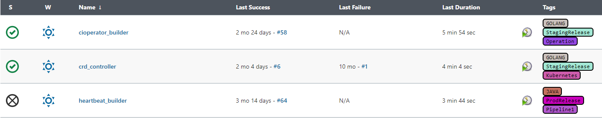

# Job Tag plugin for Jenkins

Job tag plugin is one simple plugin to help user to add multiple tags to job configuration, and display in list view.

### Description

- If jobs numbers grows, users are difficult to identify the purpose of each job. Job name would be confusing if naming convension is not clear. However, adding multiple tags for job could help easily identify the purpose of this job.
- This plugin provides a simple way to help categorize jobs in same purpose, group or pipeline. eg, job "staging_deploy_job" could have tag "STAGING" ,"DEPLOY_JOB" , "GOLDEN_RELEASE_PIPELINE"
- Integration: Other systems could get job list based on tag query, provided sample script
GitHub users to have commit permission

### Configuration

- Click "Edit Job Tags" and "Add New Tags" button will appear.

  

- Add any tag for this job. Tag characters will be converted to Uppercase by default,  duplicate and empty value are not allowed.

  

- Then you can view job tags in main view.

  

### Filter jobs by tags by running script in console or remote execute

[Example to execute script to filter jobs by tag "TAG_A" and "TAG_B"](filterjobs.groovy)

